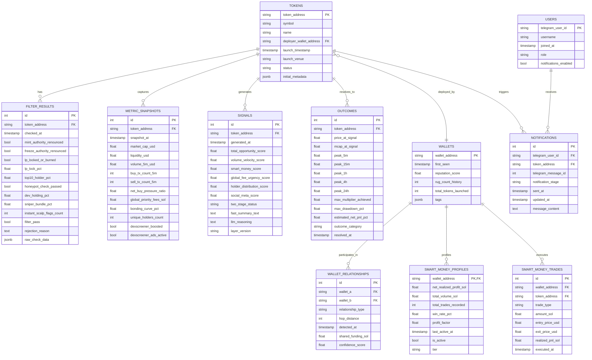

# PRD & ERD — Solana Meme Coin Safety & Signal Bot

**Versi**: 2.0 · **Diperbarui**: 22 Agustus 2026 · **Status**: Personal-use MVP (Fase Perencanaan Matang)

---

## 1. Ringkasan Eksekutif

Bot Telegram cerdas yang memantau peluncuran token meme coin baru di jaringan Solana secara real-time (mendukung **Pump.fun** dan **Raydium** AMM pools secara paralel). Sistem bertindak sebagai *radar otomatis* yang menyaring token berisiko tinggi (*rug pull, dev bundle dump, honeypot, fake wash trading*), mengevaluasi token yang lolos filter menggunakan layer sinyal momentum (*organic volume velocity, global fees urgency, smart money accumulation*), dan mendistribusikan notifikasi/call dua tahap (*two-stage alert*) ke Telegram lengkap dengan penalaran sintesis LLM.

Sistem ini murni instrumen intelijen sinyal (**notifikasi/call informasional**); keputusan eksekusi beli/jual tetap 100% berada di tangan user secara mandiri melalui terminal trading favorit (Axiom, BullX, Photon, GMGN, Trojan). Auto-execution sengaja berada di luar cakupan MVP.

---

## 2. Masalah & Konteks Pasar

Ekosistem meme coin Solana adalah lingkungan *Player-vs-Player* (PvP) berkecepatan tinggi dengan dinamika manipulasi yang sangat terstruktur:
1. **Manipulasi Bundle Tersembunyi**: Developer tidak lagi menggunakan 1 wallet tunggal. Mereka membagi suplai ke 5–20 wallet terkoordinasi di milidetik pertama (*Block-0*) menggunakan Jito Bundle, memotong batasan filter konvensional (*top holder < 3%*).
2. **Keamanan Palsu (*False Sense of Security*)**: Status *Revoke Mint* dan *Freeze Authority* sering dijadikan umpan kepercayaan oleh dev untuk memompa harga sebelum akhirnya melakukan *bundle dump*.
3. **Wash Trading & Fake Volume**: Volume jutaan dolar sering kali dihasilkan secara artifisial oleh bot internal dengan *zero priority fees* tanpa adanya tekanan beli riil dari komunitas.
4. **Keterbatasan Tools Eksisting**: Tools seperti RugCheck hanya memeriksa kode statis, terminal trading (Photon/BullX/GMGN) menyajikan data tanpa sintesis konteks menyeluruh, dan wallet tracker (Cielo) sering memicu *false alert* karena tidak memvalidasi kesehatan likuiditas token.

Bot ini dirancang untuk menutup celah tersebut dengan menggabungkan **filter on-chain ketat**, **deteksi graf pendanaan wallet**, **validasi transaksi riil via Global Fees**, serta **profiling Smart Money berbasis profitabilitas bersih**.

---

## 3. Lanskap Kompetitor & Referensi Metodologi

### 3.1 Lanskap Alat & Platform Eksisting
| Pemain | Kategori & Fokus | Kekurangan / Batasan |
|---|---|---|
| **RugCheck.xyz** | Filter Keamanan Kontrak Statis | Standar de-facto komunitas, namun hanya mendeteksi parameter statis (tidak melacak bundle Block-0 dinamis atau wash trading). |
| **GoPlus Security** | API Keamanan Multi-Chain | Analisis kode, kurang sensitif terhadap pola distribusi mikro di Solana Pump.fun. |
| **GMGN.ai / BullX / Photon** | Trading Terminal & Inline Scanner | Tempat eksekusi utama; memiliki inline warning tapi minim kurasi sinyal proaktif berbasis push notification terstruktur. |
| **Cielo Finance** | Wallet Tracker Alert Bot | Sangat baik melacak wallet, tetapi memicu alert pada setiap transaksi tanpa memfilter apakah token tersebut aman atau likuid. |
| **Trojan / Maestro / Banana** | Telegram Trading Bot | Fokus pada kecepatan eksekusi manual/snipe, bukan scoring opportunity kuantitatif. |

### 3.2 Referensi Metodologi On-Chain (Ponyin Intel - `ponyin.id`)
Prinsip-prinsip intelijen trading Solana yang diadopsi dari basis pengetahuan praktisi (*Ponyin*):
* **Konsep Monopoli Bundle**: Suplai dev terdistribusi di Block-0 adalah risiko terbesar di pasar fresh launch.
* **Global Fees Validation**: Membandingkan *Total Fee Collected* dengan *Total Volume* untuk membongkar wash trading buatan bot.
* **Instant Scalping 4-Filter Heuristic**: Pemeriksaan umur wallet (<1 hari), saldo SOL top holder (<0.2 SOL), dan anomali pump deployment.
* **Prinsip Independensi (*Free Trader*)**: Memposisikan bot sebagai pembaca data on-chain murni tanpa bias afiliasi sirkel tertentu.

### 3.3 Diferensiasi Produk
1. **Push-Notification Proaktif**: Mengirim sinyal terkurasi langsung ke Telegram secara otomatis.
2. **Two-Stage Delivery Pattern**: Mengirimkan metrik kuantitatif awal secara cepat disusul pembaruan sintesis reasoning LLM tanpa mengorbankan ketepatan waktu.
3. **Global Fee & Net Buy Verification**: Memastikan volume token didorong oleh perebutan gas/priority fee riil.
4. **Smart Money Profiling Berkelanjutan**: Mengukur performa wallet berdasarkan *Net Realized Profit SOL* riil dengan sampel trade signifikan, bukan sekadar win-rate semu.

---

## 4. Target Pengguna (Bertahap)

1. **Fase 0 – 5 (MVP & Dogfooding)**: Pembuat produk sendiri. Fase validasi algoritma, kalibrasi metrik, dan pembuktian *expected value* positif.
2. **Fase Beta Tertutup**: Trader aktif meme coin Solana dari lingkaran terdekat untuk uji coba UX notifikasi dan umpan balik sinyal.
3. **Fase Publik (Pasca Validasi)**: Trader retail Solana yang membutuhkan kurasi sinyal berkonvinsi tinggi.

---

## 5. Ruang Lingkup Produk

### 5.1 In-Scope (MVP)
- **Dual-Venue Listener**: Deteksi token baru secara paralel dari **Pump.fun** (PumpPortal WebSocket / Helius) dan **Raydium AMM pools**.
- **Hard Safety Filter & Instant Scalp Rules**:
  - Pemeriksaan Mint/Freeze Authority, status LP Burn/Lock, honeypot tax check.
  - Heuristik Ponyin: Umur wallet top holders, saldo SOL holder, anomali deployment MC.
- **Bundling & Wallet Graph Engine**:
  - Clustering transaksi Block-0 / First 10 TXs.
  - Trace sumber dana bersama (2-hop funding graph trace via Helius).
- **Opportunity & Momentum Scoring**:
  - Perhitungan Net Buy Pressure, Volume Velocity, dan Pertumbuhan Unique Holders.
  - Validasi Global Priority Fees & Jito tips untuk deteksi wash trading.
  - Deteksi status DexScreener Ads/Boosted (membedakan komitmen awal vs perangkap distribusi).
- **Smart Money Tracking Engine**:
  - Database seed list (~50–100 wallet profitable terverifikasi).
  - Background profiler otomatis untuk mempromosikan wallet dengan sampel $\ge 20$ trade dan Net Profit $> +15\text{ SOL}$, dilengkapi sistem demosi/decay berkala.
- **Two-Stage Telegram Delivery & LLM Synthesis**:
  - Stage 1: Fast-path alert berisi ringkasan skor kuantitatif + link cepat (Photon, BullX, GMGN, Solscan).
  - Stage 2: Rich-path update otomatis berisi 3 poin penalaran kontekstual berbasis LLM.
- **Structured Audit & Backtesting Engine**: Pencatatan snapshot metrik dan resolusi multi-timeframe (5m, 15m, 1h, 4h, 24h) dengan pengurangan biaya trading realistis.

### 5.2 Out-of-Scope (MVP)
- Auto-execution / copy-trading otomatis (murni notifikasi manual).
- Multi-chain (fokus eksklusif pada Solana).
- Monetisasi publik / payment gateway / subscription bot.
- Web UI Dashboard komprehensif (cukup Telegram bot & database logs untuk MVP).
- Lisensi API pihak ketiga.

---

## 6. Tech Stack

| Layer | Komponen / Teknologi | Alasan Pemilihan |
|---|---|---|
| **Data On-Chain Ingestion** | Helius RPC & Webhooks, PumpPortal WS, Shyft/QuickNode | Latensi rendah, parsing event Solana secara native, WebSocket stream stabil. |
| **Data Pasar Pelengkap** | DexScreener API, Birdeye API | Data likuiditas, volume teragregasi, status iklan/boosted, chart baseline. |
| **Backend Core & Engine** | Python 3.11+ (FastAPI, Asyncio) | Ekosistem data kuat, async concurrency tinggi, integrasi mudah ke library ML/analisis. |
| **Worker & Task Queue** | Redis (Upstash) + Celery / RQ | Pemrosesan background terisolasi (graph trace, profiling smart money, LLM synthesis). |
| **Database Relasional** | PostgreSQL | Skema data terstruktur untuk token, snapshot metrik time-series, graf wallet, sinyal, dan outcome. |
| **LLM Reasoning Synthesis** | OpenRouter (DeepSeek-V3 / Claude 3.5 Haiku) | Biaya inferensi sangat efisien dengan kemampuan sintesis penalaran terstruktur. |
| **Bot Interface** | python-telegram-bot (Webhook Mode) | Mendukung pesan interaktif, inline keyboard, dan edit pesan asinkron (*two-stage delivery*). |
| **Backtesting & Riset** | Pandas, NumPy, Jupyter Notebook | Standar industri untuk riset kuantitatif dan kalibrasi parameter. |
| **Hosting & Deployment** | Railway / Fly.io / VPS Dedicated | Lingkungan container stabil untuk background worker dan Redis listener. |

---

## 7. Arsitektur Sistem

```
[ Solana Network (Pump.fun & Raydium) ]
                 │
                 ▼
     [ Ingestion Listener Engine ]
  (PumpPortal WS & Helius Webhooks)
                 │
                 ▼
  ┌───────────────────────────────┐
  │ Fase 1: Filter Keras &        │ ──[ Gagal ]──► [ Log Drop Reason ]
  │ Heuristik Instant Scalp       │
  └───────────────────────────────┘
                 │ (Lolos)
                 ▼
  ┌───────────────────────────────┐
  │ Fase 2: Bundling &            │ ──[ Bundle > Threshold ]──► [ Log High Risk ]
  │ 2-Hop Funding Graph Engine    │
  └───────────────────────────────┘
                 │ (Aman)
                 ▼
  ┌───────────────────────────────┐
  │ Fase 3: Opportunity Scoring & │ ◄── [ Smart Money Profile Database ]
  │ Global Fee Urgency Engine     │ ◄── [ DexScreener Metadata ]
  └───────────────────────────────┘
                 │
        ┌────────┴───────────────────────────┐
        │ Trigger Opportunity Signal         │
        ▼                                    ▼
┌───────────────────────────┐      ┌───────────────────────────┐
│ Stage 1: Fast-Path Alert  │      │ Snapshot Metrik Tersimpan │
│ Kirim Notifikasi Instan   │      │ ke Database PostgreSQL    │
│ (Skor Kuantitatif + Link) │      └───────────────────────────┘
└───────────────────────────┘                    │
        │                                        ▼
        │ (Async Task)               ┌───────────────────────────┐
        ▼                            │ Fase 4 & 5: Outcome       │
┌───────────────────────────┐        │ Resolution Tracker        │
│ Stage 2: LLM Synthesis    │        │ (5m, 15m, 1h, 4h, 24h)    │
│ Update / Edit Pesan TG    │        └───────────────────────────┘
│ (+ 3-Bullet Reasoning)    │
└───────────────────────────┘
```

---

## 8. Data Model (ERD)



---

## 9. Spesifikasi Teknis & Tahapan Pengerjaan (Definition of Done)

### Fase 0 — Setup Ingestion & Dual-Venue Listener
* **Fokus**: Menyiapkan pipeline data real-time untuk **Pump.fun** dan **Raydium AMM**.
* **Detail Implementasi**:
  * Integrasi WebSocket PumpPortal (`subscribeNewToken`, `subscribeTokenTrade`).
  * Integrasi Helius RPC & webhook listener untuk transaksi pool creation di Raydium (`initialize2`).
  * Parsing metadata dasar (nama, simbol, alamat token, deployer, initial liquidity/bonding curve).
* **Definition of Done (DoD)**:
  * Sistem mampu menangkap token baru dari kedua venue secara otomatis dalam waktu $< 500\text{ms}$ sejak event on-chain terkonfirmasi.
  * Metadata tersimpan dengan benar di tabel `TOKENS`.

---

### Fase 1 — Hard Safety Filter & Instant Scalping Heuristics
* **Fokus**: Menyaring token sampah dan risiko rug pull instan sebelum masuk analisis lanjutan.
* **Detail Implementasi**:
  * **Kriteria Keamanan Raydium**:
    * `Mint Authority`: Wajib Revoked (`null`).
    * `Freeze Authority`: Wajib Revoked (`null`).
    * `LP Status`: Wajib Locked atau Burned $\ge 90\%$.
    * `Top 10 Holders Concentration`: $< 30\%$ dari total suplai yang beredar (tidak termasuk LP pool).
    * `Honeypot / Tax Simulation`: Biaya transfer / sell tax $= 0\%$.
  * **Kriteria Keamanan Pump.fun**:
    * `Dev Initial Allocation`: $< 10\%$ dari suplai bonding curve.
    * `Dev Address Rug History`: $0$ rekam jejak rug pull sebelumnya.
  * **Heuristik 4-Filter Instant Scalping (Ponyin Rules)**:
    1. *Global Gas Fee Spike*: Biaya gas jaringan sedang dalam kondisi anomali ekstrim.
    2. *Holder Age*: Umur wallet dari top 5 holder $< 1$ hari sejak pertama kali didanai.
    3. *Holder Balance*: Saldo SOL top holders $< 0.2\text{ SOL}$.
    4. *Deployment Pump Anomaly*: Token dipompa secara artifisial di bawah market cap $\$3\text{k}$ saat inisialisasi.
    * *Aturan Eksekusi*: Token di-drop jika $\ge 2$ bendera heuristik menyala.
* **Definition of Done (DoD)**:
  * Setiap token baru otomatis mendapatkan status `PASS`/`FAIL` beserta alasan penolakan yang dicatat di tabel `FILTER_RESULTS`.

---

### Fase 2 — Bundling & 2-Hop Funding Graph Engine
* **Fokus**: Membongkar koordinasi dev dan sniper tersembunyi.
* **Detail Implementasi**:
  * **Analisis Block-0 / First 10 TXs**:
    * Mengelompokkan transaksi pembelian yang terjadi di blok/slot yang sama saat token pertama kali ditransaksikan.
    * Menghitung total akumulasi persentase suplai yang dikuasai sniper/bundle ($< 25\%$ batas aman awal).
  * **2-Hop Funding Graph Trace**:
    * Menggunakan Helius Parsed Transaction API untuk menelusuri sumber pendanaan SOL dari wallet pembeli awal hingga 2 hop ke belakang.
    * Menandai wallet yang didanai dari parent wallet yang sama atau CEX deposit sub-account dalam selang waktu $< 24$ jam.
  * **Penyimpanan Reputasi Deployer**:
    * Memperbarui tabel `WALLETS` dan `WALLET_RELATIONSHIPS` untuk mencatat klaster wallet dev yang sering melakukan aksi *dump*.
* **Definition of Done (DoD)**:
  * Sistem mampu mengidentifikasi klaster bundle dev/sniper dan menolak token dengan bundle suplai yang melebihi batas toleransi.

---

### Fase 3 — Opportunity Layer, Global Fees, & Smart Money Profiling
* **Fokus**: Menilai potensi momentum, memvalidasi transaksi riil, dan memantau akumulasi modal pintar.
* **Detail Implementasi**:
  * **Formula Scoring Multi-Faktor `[HIPOTESIS AWAL]`**:
    $$\text{Score} = (0.35 \times \text{VolVelocity}) + (0.30 \times \text{SmartMoney}) + (0.15 \times \text{GlobalFeeUrgency}) + (0.10 \times \text{HolderCurve}) + (0.10 \times \text{SocialMeta})$$
    * *Volume Velocity & Net Buy Pressure*: Rasio Buy/Sell $> 1.5$ dan lonjakan volume 5 menit.
    * *Global Fees Urgency*: Mengukur rasio biaya prioritas (priority fees / Jito tips) yang dibayarkan trader vs total volume untuk memverifikasi urgensi transaksi dan memfilter *zero-fee wash trading*.
    * *DexScreener Status*: Memberi bobot positif untuk Dex Paid di awal; menandai bendera risiko jika Dex Ads/Boost baru aktif setelah lonjakan harga besar (indikasi *exit liquidity trap*).
  * **Smart Money Profiling Engine**:
    * *Seed List*: 50–100 wallet terverifikasi awal dari GMGN/Arkham/Cielo.
    * *Kriteria Promosi Mandiri*: Minimal $\ge 20$ trade tercatat, Net Realized Profit $> +15\text{ SOL}$, dan Profit Factor $> 1.8$.
    * *Sistem Demosi & Decay*: Evaluasi berkala setiap 14 hari; wallet dengan penurunan performa otomatis diturunkan statusnya dari active tier.
* **Definition of Done (DoD)**:
  * Token yang lolos filter keamanan menerima skor opportunity kuantitatif ($0$–$100$) dan snapshot metrik tercatat lengkap di `METRIC_SNAPSHOTS`.

---

### Fase 4 — Backtesting & Kalibrasi Data Historis
* **Fokus**: Menguji keabsahan hipotesis skor dan filter terhadap data historis out-of-sample.
* **Detail Implementasi**:
  * Mengumpulkan dataset minimal 200–500 token historis Solana (kombinasi token runner $\ge 2x$, token mati/rug, dan token netral).
  * Melakukan kalibrasi parameter filter dan bobot scoring opportunity menggunakan simulasi kuantitatif.
  * Menerapkan **Realistic Cost Model** (slippage bergradasi sesuai likuiditas + priority fee).
* **Definition of Done (DoD)**:
  * Laporan evaluasi kuantitatif yang membuktikan apakah layer filter dan layer opportunity menghasilkan *Expected Value (EV)* positif setelah biaya trading riil.

---

### Fase 5 — Paper Trading & Multi-Timeframe Outcome Resolution
* **Fokus**: Observasi sinyal live tanpa modal riil selama minimal 60 hari.
* **Detail Implementasi**:
  * Mencatat setiap sinyal live ke tabel `SIGNALS`.
  * Background worker secara otomatis memperbarui tabel `OUTCOMES` pada window waktu: **5 menit, 15 menit, 1 jam, 4 jam, dan 24 jam**.
  * Mencatat ATH peak, maximum drawdown (*adverse excursion*), dan status akhir (*runner / dead / neutral*).
* **Definition of Done (DoD)**:
  * Minimal 100 sinyal live terekam lengkap dengan hasil resolusi multi-timeframe.

---

### Fase 6 — Two-Stage Telegram Delivery & LLM Synthesis
* **Fokus**: Distribusi sinyal ke Telegram dengan kombinasi kecepatan dan kedalaman konteks.
* **Detail Implementasi**:
  * **Stage 1 (Fast-Path, Latensi Target $\le 3\text{--}5$ detik)**:
    * Mengirim pesan Telegram instan berisi nama token, simbol, alamat kontrak, skor opportunity, status filter keamanan, nilai Global Fee urgency, dan inline keyboard link ke Photon, BullX, GMGN, Solscan.
  * **Stage 2 (Rich-Path, $+2\text{--}3$ detik kemudian)**:
    * Worker asinkron memanggil LLM (DeepSeek-V3 / Claude 3.5 Haiku via OpenRouter) dengan payload snapshot metrik.
    * LLM menghasilkan sintesis 3 poin penalaran (*Thesis Beli*, *Faktor Risiko Terdeteksi*, *Karakteristik Likuiditas*).
    * Bot mengedit pesan Telegram yang sudah terkirim di Stage 1 secara mulus.
* **Definition of Done (DoD)**:
  * Bot Telegram aktif mengirim sinyal dua tahap yang nyaman dan informatif untuk digunakan sehari-hari.

---

### Fase 7 — Checkpoint Besar Evaluasi MVP
* **Fokus**: Pengambilan keputusan berbasis data untuk langkah selanjutnya.
* **Kriteria Keputusan**:
  * Evaluasi seluruh metrik performa terhadap kriteria rilis di Bagian 10.
  * **Keputusan**: Lanjut ke tahap uji coba modal kecil riil + beta tertutup, atau pivot/re-arsitektur strategi.

---

## 10. Kriteria Rilis, Hipotesis, & Success Metrics

> [!IMPORTANT]
> **Status Nilai Parameter & Formula**: Seluruh persentase threshold keamanan, bobot formula opportunity ($35\%/30\%/15\%/10\%/10\%$), dan batas hold wallet diberi label eksplisit sebagai **`[HIPOTESIS AWAL — WAJIB DIKALIBRASI ULANG DI FASE 4 (BACKTEST)]`**. Angka-angka ini adalah titik awal riset dan TIDAK BOLEH diperlakukan sebagai kebenaran mutlak tanpa validasi data empiris.

### 10.1 Layer Keamanan (Filter Keras & Bundle)
* **Recall Target**: $\ge 85\%$ (dari seluruh token rug pull yang diketahui di dataset backtest, minimal 85% berhasil di-flag/ditolak).
* **Precision Target**: $\ge 90\%$ (dari seluruh token yang ditolak dengan alasan high-risk, minimal 90% memang terbukti rug/dump).
* **Ukuran Sampel Minimum**: $\ge 200$ token berlabel pada backtest.

### 10.2 Layer Sinyal & Opportunity
* **Definisi "Runner"**: Token yang mengalami kenaikan harga $\ge 2x$ (+100%) dari harga saat sinyal dalam kurun waktu 24 jam, tanpa mengalami penurunan (*drawdown*) $> 70\%$ sebelum mencapai target tersebut.
* **Definisi "Dead / Rug"**: Likuiditas ditarik (LP pulled), dev bundle dump $> 80\%$, atau harga turun $> 80\%$ dalam kurun waktu 24 jam.
* **Hit-Rate Target `[HIPOTESIS AWAL]`**: $\ge 20\%$ dari sinyal yang diterbitkan berhasil menjadi *Runner*.
* **Expected Value (EV) Positif**:
  $$\text{Expected Value} = (\text{Hit-Rate} \times \text{Rata-rata Net Gain Runner}) - ((1 - \text{Hit-Rate}) \times \text{Rata-rata Loss}) > 0$$
  *Wajib bernilai positif setelah memperhitungkan biaya trading riil.*
* **Baseline Margin**: Hit-rate sinyal opportunity harus mengungguli *baseline acak* (token yang hanya lolos filter keamanan tanpa skor opportunity) dengan margin signifikan ($\ge +10\%$).
* **Ukuran Sampel Paper Trading**: $\ge 100$ sinyal live selama $\ge 60$ hari observasi berkelanjutan.

### 10.3 Model Biaya Trading Realistis `[SIMPLIFIKASI AWAL]`
Untuk mencegah overestimasi profitabilitas, simulasi paper trading dan backtest wajib memotong biaya berikut:
* **Slippage Bergradasi Berbasis Likuiditas**:
  * Likuiditas Pool $< \$10\text{k} \rightarrow$ Asumsi Slippage $15\%\text{--}20\%$ round-trip.
  * Likuiditas Pool $\$10\text{k}\text{--}\$50\text{k} \rightarrow$ Asumsi Slippage $10\%$ round-trip.
  * Likuiditas Pool $> \$50\text{k} \rightarrow$ Asumsi Slippage $4\%\text{--}6\%$ round-trip.
* **Priority Fee & Jito Tip Simulation**: Pengurangan flat $0.02\text{ SOL}$ per transaksi buy/sell.

---

## 11. Manajemen Risiko & Mitigasi

1. **Pergeseran Pola Manipulasi Pasar (*Adversarial Dynamics*)**:
   * *Risiko*: Sindikat dev/cabal terus memodifikasi cara bundling (misal: multi-layer sub-wallets, off-chain mixing).
   * *Mitigasi*: Arsitektur modular yang memungkinkan penambahan lapisan heuristik baru (seperti heuristik Ponyin) tanpa merombak sistem utama.
2. **Risiko Overfitting & False Precision**:
   * *Risiko*: Mengunci bobot formula sebelum data empiris terkumpul.
   * *Mitigasi*: Kewajiban kalibrasi parameter di Fase 4 dan pengujian out-of-sample secara berkala.
3. **Risiko Halusinasi LLM**:
   * *Risiko*: LLM memberikan narasi positif pada token berbahaya.
   * *Mitigasi*: LLM hanya bertindak sebagai layer sintesis sekunder (Stage 2) atas data kuantitatif yang sudah lolos filter keras; prompt diwajibkan menyertakan data on-chain faktual tanpa izin berspekulasi.
4. **Ketergantungan Infrastruktur RPC & WebSocket**:
   * *Risiko*: WebSocket PumpPortal atau Helius mengalami disconnect/rate limit.
   * *Mitigasi*: Mekanisme *auto-reconnect with exponential backoff* dan fallback ke polling endpoint RPC sekunder.

---

## 12. Di Luar Cakupan MVP (Pengembangan Lanjutan)

Fitur-fitur berikut secara sadar ditunda hingga Checkpoint Evaluasi (Fase 7) terbukti berhasil:
* **Auto-Execution / Sniper Bot Integration**: Eksekusi transaksi otomatis langsung via private key on-chain.
* **Multi-Chain Expansion**: Dukungan untuk jaringan Base, BSC, atau Ethereum L2.
* **SaaS & Subscription Management**: Sistem membership berbayar, manajemen kuota, dan pembayaran via bot.
* **Full-Fledged Web Dashboard**: Portal visual analitik web interaktif.
